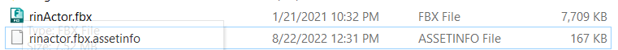
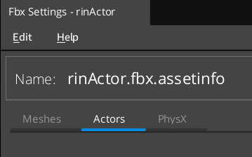
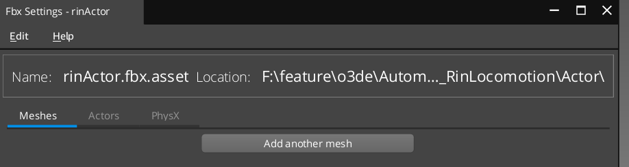
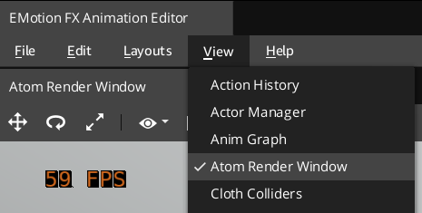

# Migration guideline for animation: From Lumberyard to O3DE

## Overview

This document aims to provide an initial migration guide for any Lumberyard customer trying to migrate their game to O3DE, with specific focus on animation assets.

This guide will be covering assets that are commonly used in the animation editor, including but not limited to: actor, motion, motionset, animgraph and workspace. This article is designed to be the go-to document to collect all the questions and answers for migrating animation related files from Lumberyard 1.28 to O3DE.

## Actor Asset

The most significant change to the actor asset from Lumberyard 1.28 to O3DE is that EMotionFX::Mesh has been deprecated and replaced with the Atom mesh format (Atom::Model). Previously in Lumberyard 1.28, all export settings related to actor (skinned mesh) can be found under the actor tab in fbx settings. In O3DE, due to the usage of the atom mesh format, export settings related to the mesh have moved under the mesh tab. This step currently has to be performed manually following the steps below.

## Migration steps

1. Navigate to source file (.fbx). Check if there is an .assetInfo file with the same name of the source file. The assetInfo file contains the metadata for the actor asset. If there isn't any .assetInfo file, it means this asset is exported using the default settings. You can skip these steps.<br.

2. In the O3DE main editor, right-click on the source file → Edit settings. Wait for the process to finish and the setting page pop-up.
3. You should see three tabs created. The actor tab should be opened by default, and you should see a few actor related settings. However, the first thing to do for this asset is to manually add a mesh under the meshes tab. To do that, first click on the Meshes tab. 

4. Under the mesh tab it should be empty, with only one button says "Add another mesh". Click this button. 

5. Now that you have both an actor and mesh created for this asset, check if any export rule needs to be moved from the actor tab to the mesh tab. Using the following guidance.
6. Click update.

| Modifier Name (Ly 1.28) | Description | Migration Guideline |
| ------------ | ------------ | ------------ |
| Select Meshes | Moved under Mesh tab. | Select all the meshes you want to export in the mesh tab. |
| Mesh | Replaced by Mesh (Advanced) modifier under mesh tab. | Use Mesh (Advanced) Modifier under mesh tab. |
| Skin | Moved under Mesh tab. | Manually create a new modifier under mesh tab, and delete the old one under actor tab. |
| Material | Same as above. | Same as above. |
| Tangents | Same as above. | Same as above. |
| Cloth | Same as above. | Same as above. |
| Scale Actor | No longer available.  | Use Advance settings under Coordinate System Change modifier to change the scale. |
| Skeleton LOD | Skeleton LOD now only controls the skeleton LOD. The mesh LOD will be handled in the LOD modifier under mesh tab. | Keep the skeleton LOD modifier. Add a LOD modifier under mesh tab. Select mesh based on LOD. |
| Coordinate System Change | Added an advance setting option. | You will need to have duplicate the coordinate system change modifier on mesh to keep the skeleton and the mesh in sync. |

## Motion Assets

The most noticeable improvement from Lumberyard 1.28 to O3DE around motion is that the system behind sampling motion has been re-written from scratch. This change has significantly improved the efficiency and quality of motion sampling. It offers both uniform and non-uniform sampling method options. If you want to learn more about the in-depth technical aspect of motion sampling improvement, see this article. (link to FBX Motion Sampling Settings page)

### Migration steps

1. Navigate to the source fbx file that contains the motion data in the O3DE main editor (under asset browser)

2. Right-click on the source file, right click → edit settings

3. Wait for the fbx settings page pop up. You should see a Motion sampling rule created by default.

4. The motion sampling modifier is an improved version of the "Compression settings", with much more option to explore.

5. Edit settings based on your need for the motion file, then click update button.

| Modifier Name (Ly 1.28) | Description | Migration guideline |
| ------------ | ------------ | ------------ |
| Compression settings | Replaced by Motion sampling modifier. | Adjust the quality bar on the sampling modifier based on needs. |
| Scale motion | No longer available. | Use Advance settings under Coordinate System Change modifier to change the scale. |

## Animation Editor

Since Lumberyard 1.28 we have removed all OpenGL rendering inside of the animation editor and replaced it with the Atom renderer. The new Atom render window has replaced the OpenGL render viewport. As a result, any user custom layout that still references the OpenGL render window will report a warning when opening and will not load any viewport window.

We also made many more UX/UI improvements throughout the animation editor.

### Migration steps

We recommend creating your custom layout from the default layout. If you have custom layout you want to bring back in O3DE, you can still use it, but keep in mind that you have to manually add the atom render window if you want a viewport. You can do this by clicking the view menu in the animation editor, and then select the atom render window.

## AnimGraph, MotionSets and Workspaces

The motionSets and workspaces currently store a relative path to the project root. When you move those files to a new project, you need to have the same relative path to the project root if you want to keep the motion set and workspace valid. Otherwise, we recommend you recreate the motionSets file referencing the motion under new path, then create the workspace that reference the actor, motionset and animgraph.

Note: This is not an issue just for migrating from Lumberyard 1.28 to O3DE, but also could occur if you want to move source file around in the same project.

## Others

1.  .assetInfo will be serialized into JSON instead of XML in O3DE. You can still load the XML format of the .assetInfo, but once you hit update the file will be converted into JSON format. This improves readability and reduced file sizes.

2. The default debug rendering option 

##### Updated Aug 2022