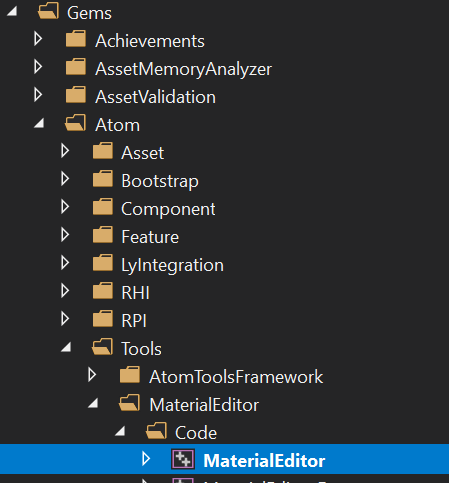

# Converting a Legacy Renderer Project to an Atom Project

## 1. Conversion Details
### 1.1. Porting an Existing Project to Atom in O3DE/main

Example: porting Automated Testing project from legacy graphics to Atom renderer

1. Update tools_dependencies and runtime_dependencies in the project as follows: 
 1. add Atom targets by mimicking AtomTest project: 
 1. in Gem\Code\runtime_dependencies.cmake add these dependencies: 
	1. <table><tr><td>Gem::Atom_AtomBridge</td></tr></table>
 2. in Gem\Code\tool_dependencies.cmake add these dependencies: 
	1. <table><tr><td>Gem::Atom_AtomBridge.Editor</td></tr></table>
 3. There is no need to modify platform specific dependencies, as AtomBridge will pull that in for you.
 2. Replace ImageProcessing targets with ImageProcessingAtom targets 
 1. Gem::ImageProcessing.Editor →  Gem::ImageProcessingAtom.Editor
 3. In CMakeLists.txt for the project gem, add  Gem::Atom_AtomBridge.Static as a build dependency
<table><tr><td>
    BUILD_DEPENDENCIES
           PRIVATE
                ...
    Gem::Atom_AtomBridge.Static 
	)</td></tr></table>
1. (Windows) Re-Generate Visual Studio: 
 1. cmake .. -G "Visual Studio 16 2019" -A x64 -T host=x64 -DLY_3RDPARTY_PATH=C:\p4\3rdparty\lyengine\3rdParty\ -DLY_PROJECTS=AutomatedTesting
3. Compile Editor project
4. Copy over basic Atom assets from AtomTest project to AutomatedTesting: 
   1. dev\AtomTest\Config\AtomImageBuilder\  → dev\AutomatedTesting\Config\AtomImageBuilder\
 2. dev\AtomTest\LightingPresets\
 3. dev\AtomTest\Materials\
 4. dev\AtomTest\ShaderLib\
 5. dev\AtomTest\Shaders\
5. run Asset Processor
6. run the Editor and things should now work with Atom enabled

###1.2. Important Note after the Conversion

1. Most legacy slices will be broken due to legacy components no longer being available
 1. for example: the legacy Mesh component, which needs to be replaced with Atom's Mesh component
 2. legacy Mesh components is equivalent to Atom's Mesh + Material component
2. Some unsupported legacy systems are disabled when Atom is enabled e.g. Particles and terrain system.
3. We have a script for converting mesh components and materials to Atom mesh components and materials. It's not one to one, but it's a start. StarterGame on Atom

### 2. Automated Testing of Critical Features in the Atom Renderer

There are various ways to run Atom Automated tests:

#### 1. Using Lumberyard's CTest script. Automated tests are automatically enabled with Atom (see this CR for more info)
- Recommended to run this before committing code.
- This does not display individual Pytest tests that were run.

See sample output here: 

    #This assumes you are in the dev folder
    .\ctest_scripts\ctest_entrypoint.cmd --build-path .\<your_build_path>\ --suite main --only-gpu --config profile

    #Run all tests via Cmake -
	.\ctest_scripts\ctest_entrypoint.cmd --build-path .<your_cmake_build_folder>\ --suite main --only-gpu --config profile 
    
    PS D:\atom_9111\dev> .\ctest_scripts\ctest_entrypoint.cmd --build-path .\build\ --suite main --only-gpu --config profile                                                                               Using CTest executable from PATH: C:\Users\Downloads\cmake-3.18.1-win32-x86\cmake-3.18.1-win32-x86\bin\ctest.exe
    Starting 'main' suite: The default set of tests, covers most of all testing.
    Executing CTest with command:
      C:\Downloads\cmake-3.18.1-win32-x86\cmake-3.18.1-win32-x86\bin\ctest.exe --build-config profile --output-on-failure --parallel 16 --label-regex ^(REQUIRES_gpu)$ --label-exclude ^(SUITE_smoke|SUITE_periodic|SUITE_benchmark)$
    in working directory:
      .\build\
    
    Test project D:/atom_9111/dev/build
        Start   2: AutomatedTests_AtomTests.main::TEST_RUN
    1/2 Test   #2: AutomatedTests_AtomTests.main::TEST_RUN ..........   Passed  235.64 sec
        Start 193: pytest_sanity_main_requires_gpu.main::TEST_RUN
    2/2 Test #193: pytest_sanity_main_requires_gpu.main::TEST_RUN ...   Passed    1.04 sec
    
    100% tests passed, 0 tests failed out of 2
    
    Label Time Summary:
    REQUIRES_gpu    = 236.68 secproc (2 tests)
    SUITE_main      = 236.68 secproc (2 tests)
    
    Total Test time (real) = 237.21 sec

#### 2. Using Pytest Directly
- This will display all Pytest tests that were run. 
- Recommended to run if ctest automated test is disabled. 
See sample output here:

    #this assumes you are in the dev folder
    .\Tools\Python\python3.cmd -m pytest -v --build-directory=".\<your_build_path>\bin\profile" AtomTest\Gem\PythonTests\Automated

    #Add some flags to reduce the log output
    .\Tools\Python\python3.cmd -m pytest -v --show-capture=no --build-directory=".\<your_build_path>\bin\profile" AtomTest\Gem\PythonTests\Automated

    #Open Beyond Compare when screenshot comparison fails
    .\Tools\Python\python3.cmd -m pytest -v --open-beyond-compare --show-capture=no --build-directory=".\<your_build_path>\bin\profile" AtomTest\Gem\PythonTests\Automated

    #Running Pytest tests
    
    PS D:\Perforce\atom\dev> .\Tools\Python\python3.cmd -m pytest -v --build-directory=".\build2\bin\profile" AtomTest\Gem\PythonTests\Automated
    ================================================= test session starts =================================================
    platform win32 -- Python 3.7.5, pytest-5.3.2, py-1.8.1, pluggy-0.13.1 -- D:\Perforce\atom\dev\Tools\Python\3.7.5\windows\python.exe
    D:\Perforce\atom\dev\conftest.py:39: RuntimeWarning: Warning! lmbr_test_pytest.ini is not being used! Use lmbr_test when running pytest tests from the dev directory. (eg. lmbr_test pytest <PATH_TO_TEST>)
      warnings.warn(INIFILE_WARNING, RuntimeWarning)
    cachedir: .pytest_cache
    rootdir: D:\Perforce\atom\dev
    plugins: mock-2.0.0, timeout-1.3.4, ly-test-tools-1.0.0
    collected 7 items
    
    AtomTest/Gem/PythonTests/Automated/C18261928_EnterGameMode_test.py::TestAutomation::test_C18261928_EnterGameMode[AtomTest-all-profile-win_x64_vs2017] PASSED [ 14%]
    AtomTest/Gem/PythonTests/Automated/C18751210_SpotLightIntensity_test.py::TestAutomation::test_C18751210_SpotLightIntensity[AtomTest-all-profile-win_x64_vs2017] PASSED [ 28%]
    AtomTest/Gem/PythonTests/Automated/C23490360_GridComponent_test.py::TestAutomation::test_C23490360_GridComponent[AtomTest-all-profile-win_x64_vs2017] PASSED [ 42%]
    AtomTest/Gem/PythonTests/Automated/C30993187_HDRiSkyboxComponent_test.py::TestAutomation::test_C30993187_HDRiSkyboxComponent[AtomTest-all-profile-win_x64_vs2017] PASSED [ 57%]
    AtomTest/Gem/PythonTests/Automated/C30993188_MaterialComponent_test.py::TestAutomation::test_C30993188_MaterialComponent[AtomTest-all-profile-win_x64_vs2017] PASSED [ 71%]
    AtomTest/Gem/PythonTests/Automated/C30993189_MeshComponent_test.py::TestAutomation::test_C30993189_MeshComponent[AtomTest-all-profile-win_x64_vs2017] PASSED [ 85%]
    ...

1. Should there be any issues running automated tests, please manually verify that Atom is working:
- Atom's Material Editor works

- Editor launches with Atom enabled
- Atom's Mesh/Material components are functional

##### Updated Sept 2022