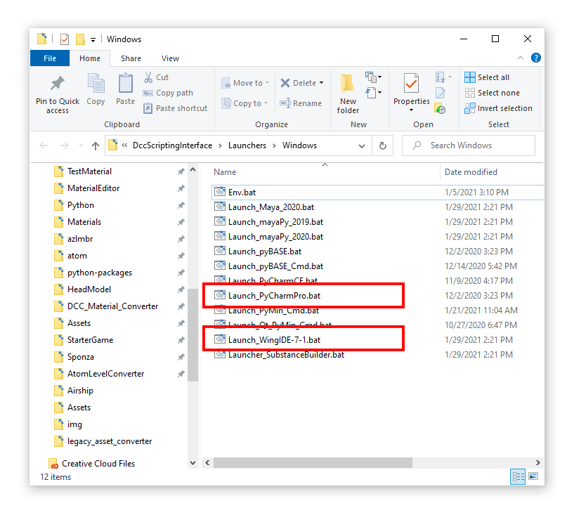
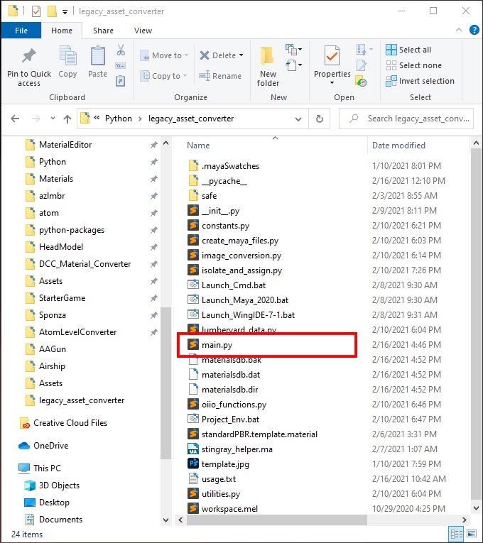
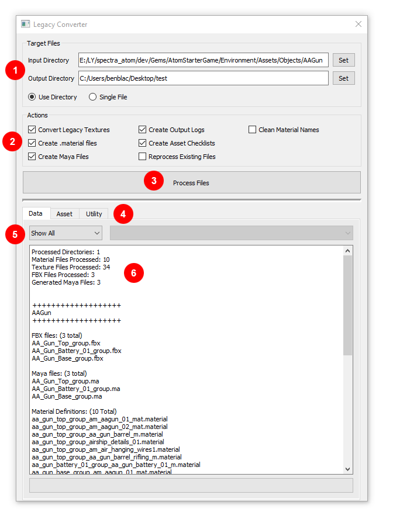
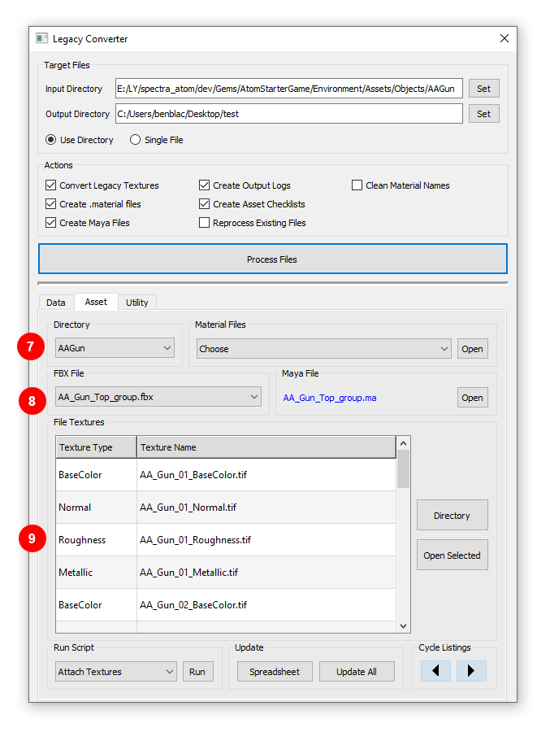

# Legacy Asset Conversion Utility (StarterGame)

## Overview

This page covers a work in progress utility for upgrading legacy assets to work with O3DE (Spectra+Atom)

Why do we need to convert legacy assets?:

- Legacy CryRenderer used .mtl files (materials) and the Illum shader for physically based rendering (PBR)
 - The legacy materials used the 'Specular Gloss workflow'
- Atom provides a new shader/material system, Atom materials are now assets (.material) and we have a more modern PBR material (StandardPRB)
 - When we started Atom most game teams requested the 'Metallic / Roughness workflow' to be the default standard
- The convert utility helps bring assets forward to new standard (it also has some extra bells and whistles)

## Need to Know

Before you can run the tool go through this checklist:

1. The script is part of the DccScriptingInterface Gem (DCCsi): C:\Depot\O3DE\Gems\AtomLyIntegration\TechnicalArt\DccScriptingInterface
2. The DCCsi is mostly python based, make sure python is set up:
 1. Lumberyard includes a python distribution, the first thing you should do is make sure it's setup
 2. "C:\Depot\O3DE\python\get_python.bat"
3. Make sure the DCCsi Gem is enabled in your project
 1. Command line tool for managing Gems is here: C:\Depot\O3DE\scripts\o3de.bat
4. The DCCsi is a code-lite Gem:
 1. It has just enough C++ code to be a compiled Gem
 2. It is a compiled Gem so that it is scanned for python extensions at boot (this is a pattern related to EdiorPythonBindings)
 3. The entry-point for the scan is: "Gems\AtomLyIntegration\TechnicalArt\DccScriptingInterface\Editor\Scripts\bootstrap.py"
 4. This would for example allow us to launch this tool from a Lumberyard menu (we have not done this yet)
5. The other reason it's a compiled Gem is because of the way python and 3rdParty package dependencies have changed 
 1. The DCCsi has its own pip dependencies defined in: "C:\Depot\O3DE\Gems\AtomLyIntegration\TechnicalArt\DccScriptingInterface\requirements.txt"
 2. When a project is built that includes the DCCsi Gem then the requirements.txt will install the package dependencies 
 3. They will end up somewhere like: C:\Depot\O3DE\python\runtime\python-3.7.10-rev1-windows\python\Lib\site-packages
6. Non-pip packages: 
 1. Tools in the DCCsi will occasionally use packages that are not available as a standard pip install, for example OpenImageIO (oiio)
 2. We build oiio, and it gets pulled down with cmake. This process includes building the oiiotool.exe and python bindings (pyd)
 3. Right now I think the only visual studio target that builds this is Atom_utils (I've been building that to make sure that OpenImageIO is handled)
 4. There is currently a bug and the .pyd is not copied over during a build (so imports in python fail on that module)
 5. Find the equivalent of this file: "C:\Depot\3rdParty\packages\openimageio-2.1.16.0-rev1-windows\FindOpenImageIO.cmake" add modify 
 a. ${PATH_TO_BINS}/OpenImageIO.pyd

## Validation

You can do the following to test of the core functionality of the DCCsi is set up and working properly

Use this .bat file to launch a Windows command-line with a custom environment:  "C:\Depot\O3DE\Gems\AtomLyIntegration\TechnicalArt\DccScriptingInterface\Launchers\Windows\Launch_PyMin_Cmd.bat"

- ^ Sets up some DCCsi envar hooks

From that command line the following should work:

 <table>
  <tr>
    <th>Command</th>
    <th>Action</th>
    <th>Troubleshooting</th>
  </tr>
  <tr>
    <td>> python</td>
    <td>starts the editor python distribution</td>
    <td>Should be "Python 3.7.10 (tags/v3.7.10:9b2dd1f, Feb 18 2021, 12:57:19) [MSC v.1916 64 bit (AMD64)] on win32".

If it doesn't launch python, see step 2 above. Make sure the python runtime is set up: C:\Depot\O3DE\python\runtime.
</td>
  </tr>
  <tr>
    <td>> python config.py</td>
    <td>tests the DCCsi core configuration</td>
    <td>This is a procedural/synthetic environment configured using a python package called dynaconf.

you should get some logging and a pyside2 test button labeled "Hello World!" should pop-up.

If nothing happens the logging likely will let us know what failed, generally it's one of these things:

1. if an import fails, the requirements.txt may not be installed.
2. ^ is the DCCsi enabled as a project gem?
3. ^ did you build your project?
4. ^ did you see the DCCsi requirement get installed when you configured your build with cmake?

If you experience any issues or need help, check out https://discord.gg/o3de

</td>
  </tr>
  <tr>
    <td>> python SDK\Maya\Scripts\Python\legacy_asset_converter\main.py</td>
    <td>launch the Legacy Asset Converter</td>
    <td>TBD</td>
  </tr>
</table>

## Current Status

The scripts can convert Spec/Gloss/.mtl legacy Lumberyard formatted asset directories to the newer StandardPBR Metal/Rough/.material formatting. The script also uses numerical settings found within the mtl file to handle things such as texture rotation and tiling, color settings, and intensity values (such as emissive intensity). Finally, included in the conversion process, companion Maya files are generated for each FBX asset, which have had materials from the original FBX converted to StingrayPBS materials for further look development work.

### Script Output

**Files In (Legacy):**

<u>Texture types:</u>
- Diffuse
- Ddna
- Specular
- Emissive

<u>Material Definition File:</u>

".mtl"

**Files Out (StandardPBR):**

<u>Texture types:</u>

- BaseColor
- Roughness
- Metallic
- Normal
- Emissive

<u>Material Definition File:</u>

'.material"

## Steps to Perform a Conversion

### DCCsi Launchers Location:

.../LY/spectra_atom/dev/Gems/AtomLyIntegration/TechnicalArt/DccScriptingInterface/Launchers/Windows

Besides being useful for development these IDE launchers are especially important because a standalone CLI is not yet available.

The launch .bat files will automatically configure the environment required to run the tool.

**PyCharm:**

Use PyCharm Professional 2020.3 -- Launcher file: Launch_PyCharmPro.bat

**Wing:**

Use Wing Pro 7.x -- Launcher file: Launch_WingIDE-7-1.bat

### Scripts Location:

../LY/spectra_atom/dev/Gems/AtomLyIntegration/TechnicalArt/DccScriptingInterface/SDK/Maya/Scripts/Python/legacy_asset_converter

The entry point to the scripts is through "main.py"

### The Tool

There are only two requirements for running the tool:

1. Bootstrapping the scripts to Lumberyard using the .bat file setup of the DCCsi (see screenshot above).
2. Setting an input directory/file and an output directory (#1). 

3. There are several output options that can be activated or deactivated using the checkboxes next to them (see the "Actions" button group (#2)), but it is recommended that you leave these at their default. Once these items have been addressed, click on the Process Files button (#3).

There are detailed log messages that can help you to get an idea of what assets the script is processing that should be viewable in the output window of the IDE. Once the script completes an audit of all processed files is displayed in the UI (#6). If you have processed multiple asset directories you can filter the audit results using the combobox with the text "Show All" (#5). For the next window, click on the "Asset" tab (#4). This window is for refined information relating to the files that have been processed.

To switch information displayed between processed directories, use the "Directory" combobox (#7). Each directory will contain one or more FBX files. The FBX file is what assets like material files and textures relate to- switch between all present in the specified directory using the "FBX File" combobox (#8). Each FBX can have texture files assigned to materials inside them. For a full list of what texture files correspond to the FBX look in the image table below (#9). There are several buttons present to launch selected files or view material files generated as well.

## Remaining Work

1. There was a bug discovered in Maya that prevents the script from assigning file textures to StingrayPBS in an automated fashion. A script was created that will assign those file textures, although in its current state it fuses together surfaces with each respective material into single objects. It was discovered later that this is not ideal, as in several scenarios there are LOD geometry layers that contain the same materials and are getting combined (which is not desirable). The script was originally built using the Maya python API to retrieve material information and assignments directly from each FBX, but this has since been simplified by relying on .assetinfo files which is a much cleaner way to extract needed information. The texture assignment script needs to be modified to leverage geometry assignments gathered from this improved method.
2. Some investigation is needed to understand why file size grows significantly with each subsequent conversion process run with the tool. With each run the tool should be only updating information that it doesn't already contain. Through testing, it was found that there are significant increases to file size with each run, even when the amount of new information would equate to a very small amount of actual data.
3. Part of the utility of the script should be that in addition to making the initial conversion, it should also facilitate additional help or resources to finalize conversion. Due to the large number of factors involved, a perfect conversion is very unlikely. This means that a user may need to perform additional cleanup work, and this presents an opportunity to further streamline the process. The creation of a Substance Designer file with textures, masks, and node tree setups would be a very valuable addition to the toolset to help facilitate tweaks. The other functionality that would be helpful would be the ability to run scripts and commands from the Standalone QT UI directly to Maya. This would allow users a very seamless bridge, and with a little dedicated time is well within our reach. Both of these proposed features might also benefit our DCCsi toolset beyond the conversion scripts.
4. Set up Dynaconf to handle the bootstrapping of the scripts to the DCCsi environment settings

##### Updated Aug 2022