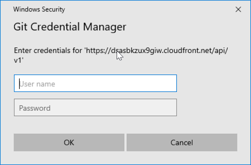

A detailed explanation and troubleshooting guide can be found here:
https://o3deorg.netlify.app/docs/welcome-guide/setup/setup-from-github/

## Getting started

### 1 Fork in the cloud

1. Visit https://github.com/aws-lumberyard/o3de
2. Click `Fork` button (top right of the web page) to establish a create a fork under your GitHub account.
3. You should now have a fork where user is your GitHub ID at https://github.com/<user>/o3de

### 2 Clone fork to local storage

Set `user` to match your GitHub profile ID:

```sh
set user=TestUser #{change to your GitHub profile ID}
set working_dir=C:\Open3DSrc #{change to your working drive path}
```

Create your clone:

```sh
mkdir %working_dir%
cd %working_dir%

git clone https://github.com/%user%/o3de.git

# Enter your GitHub username and token when prompted
# Cloning into 'o3de'...
# Username for 'https://github.com/%user%/o3de.git':
 
# Enter your Github token for the LFS endpoint when prompted:
# Password for 'https://d111jhwumogxnd.cloudfront.net/api/v1':

```

You may also see the following popups. Use your username and personal access token for these as well:


Followed by:



You should no longer receive credential prompts if you setup the credential manager for git
If you get stuck on a step that looks like the following, press <enter> to get prompted for a password, at which point you enter your Github token again:
```sh
Updating files: 100% (32238/32238), done.front.net/api/v1': Updating files:   8% (2580/32238)
```

After the clone is complete, CD into the root of the synced repo and and setup LFS then pull down the objects

```sh
# Setup LFS
git lfs install
 
# Pull down LFS objects
git lfs pull
```
This step may be unnecessary if git lfs is already installed on your computer and LFS files were pulled during the clone "filtering repo" stage. Running it again won't hurt.

Optionally you may also want to retrieve the content samples here:
```sh
cd %working_dir%
git clone https://github.com/aws-lumberyard/o3de-atomtest.git
git clone https://github.com/aws-lumberyard/o3de-atom-sampleviewer.git

```

You may want to rename and moved (or copy) them inside of the O3DE folder like such:

```sh
cd %working_dir%
move o3de-atomtest o3de\AtomTest
move o3de-atom-sampleviewer o3de\AtomSampleViewer
```

### 3 Sync your local workspace with O3DE

1. Set your upstream remote. This should point to the aws-lumberyard/o3de repo and will only need to be performed once in your local workspace. Run this inside the repo directory.

```sh
cd %working_dir%/o3de
git remote add upstream https://github.com/aws-lumberyard/o3de.git
```
2. Set your local main branch to track upstream/main (O3DE) and fetch latest. Running git pull will get changes directly from upstream/main

```sh
git checkout main
 
git fetch upstream
git branch -u upstream/main
git pull
```

   - Do not merge changes to your local main branch. Create a branch off main to stage your changes to submit a pull request. This will prevent merge conflicts and when fetching latest from upstream.

   - If you are making changes to a release branch replace main with the release branch on the O3DE repo. Now you can create a new branch off release to stage your changes. Example:

```sh
git checkout --track upstream/1.0
git pull
```

##### Verify remotes

Run the following command to verify your workspace is pointing to the correct remotes.

```sh
git remote -v
 
# Result
origin    https://github.com/aws-lumberyard/o3de.git (fetch)
origin    https://github.com/aws-lumberyard/o3de.git (push)
upstream    https://github.com/TestUser/o3de.git (fetch)
upstream    https://github.com/TestUser/o3de.git (push)
```
Note:

    origin should point to TestUser (your user repo fork)
    upstream should point to aws-lumberyard (source of truth)


## Tips and help

##### Create a branch

1. Create a new branch or checkout an existing one
```sh
# Create a new branch
git checkout -b <newBranchName>

# Checkout an existing branch
git fetch origin
git checkout <existingBranchName>
```

##### Develop on a branch

1. Checkout branch and get latest
```sh
git checkout <branchName>
git pull
```
2. Make changes and commit locally

```
git status
git add <filename_or_directory>
git commit -m "<description of your change>"
```

3. Push changes to the remote. This is required to share your changes, run Automated Reviews, and submit Pull Requests

```sh
# First push. This maps your local branch to the remote.
git push -u origin <newBranchName>

# Afterwards you can use the following
git push
```

##### Merge upstream/main into your branch

These steps can be used to bring your branch up-to-date with aws-lumberyard:main and resolve merge conflicts

1. Checkout main and get latest
```sh
git checkout main
git pull
```
   Your local main should be set to track O3DE/main. Steps under the **Sync local workspace with O3DE** section above. 

2. Move back to your branch and get latest
```sh
git checkout <branchName>
git pull
```

3. Merge main to your branch
```sh
git merge main
```
   - If merge conflicts are detected:
```sh
git mergetool # (Optional) Conflicts can be resolved with most git gui clients. 
git add <filename_or_directory> # Stage resolved files for commit
git status # Verify all conflicts are resolved
git commit
```
   - You can run 'git merge --abort' to stop the merge.

4. Push merge commit to remote
```sh
git push
```

Submit a Pull Request

- Check out the pull request [process](/contributors/guide/pull-requests.md) for more details and advice.

1. Go to your Github fork > Pull Requests tab: https://github.com/TestUser/o3de/pulls
2. Click **New Pull Request**
3. Click compare and select your branch. Verify the base repo (target) is set to **aws-lumberyard/o3de** and branch is set to **main** or another target branch (e.g. 1.0). 
4. Click **Create pull request**
   a. Only submit Pull Requests to aws-lumberyard:main (not to the fork's main in TestUser)


5. Add details.
   a. Enter title and description
   b. Add reviewers: assign to GitHub users or teams
      i. The list of SIG teams in GitHub is located here: https://github.com/orgs/aws-lumberyard/teams/o3de-sigs/teams
   c. Click **Create pull request**


_If you have upstream write access_, please refrain from using the GitHub UI for
creating PRs, because GitHub will create the PR branch inside the main
repository rather than inside your fork.

#### Get a code review

Once your pull request has been opened it will be assigned to one or more
reviewers.  Those reviewers will do a thorough code review, looking for
correctness, bugs, opportunities for improvement, documentation and comments,
and style.

Commit changes made in response to review comments to the same branch on your
fork.

Very small PRs are easy to review.  Very large PRs are very difficult to review.

#### Squash commits

After a review, prepare your PR for merging by squashing your commits.

All commits left on your branch after a review should represent meaningful milestones or units of work. Use commits to add clarity to the development and review process.

Before merging a PR, squash the following kinds of commits:

- Fixes/review feedback
- Typos
- Merges and rebases
- Work in progress

Aim to have every commit in a PR compile and pass tests independently if you can, but it's not a requirement. In particular, `merge` commits must be removed, as they will not pass tests.

To squash your commits, perform an [interactive
rebase](https://git-scm.com/book/en/v2/Git-Tools-Rewriting-History):

1. Check your git branch:

  ```
  git status
  ```

  Output is similar to:

  ```
  On branch your-contribution
  Your branch is up to date with 'origin/your-contribution'.
  ```

2. Start an interactive rebase using a specific commit hash, or count backwards from your last commit using `HEAD~<n>`, where `<n>` represents the number of commits to include in the rebase.

  ```
  git rebase -i HEAD~3
  ```

  Output is similar to:

  ```
  pick 2ebe926 Original commit
  pick 31f33e9 Address feedback
  pick b0315fe Second unit of work

  # Rebase 7c34fc9..b0315ff onto 7c34fc9 (3 commands)
  #
  # Commands:
  # p, pick <commit> = use commit
  # r, reword <commit> = use commit, but edit the commit message
  # e, edit <commit> = use commit, but stop for amending
  # s, squash <commit> = use commit, but meld into previous commit
  # f, fixup <commit> = like "squash", but discard this commit's log message

  ...

  ```

3. Use a command line text editor to change the word `pick` to `fixup` for the commits you want to squash, then save your changes and continue the rebase:

  ```
  pick 2ebe926 Original commit
  squash 31f33e9 Address feedback
  pick b0315fe Second unit of work

  ...

  ```

  Output (after saving changes) is similar to:

  ```
  [detached HEAD 61fdded] Second unit of work
   Date: Thu Mar 5 19:01:32 2020 +0100
   2 files changed, 15 insertions(+), 1 deletion(-)

   ...

  Successfully rebased and updated refs/heads/main.
  ```
4. Force push your changes to your remote branch:

  ```
  git push --force
  ```

For mass automated fixups (e.g. automated doc formatting), use one or more
commits for the changes to tooling and a final commit to apply the fixup en
masse. This makes reviews easier.

### Merging a commit

Once you've received review and approval, your commits are squashed, your PR is ready for merging.

Merging happens automatically after both a Reviewer and Approver have approved the PR. If you haven't squashed your commits, they may ask you to do so before approving a PR.

### Reverting a commit

In case you wish to revert a commit, use the following instructions.

_If you have upstream write access_, please refrain from using the
`Revert` button in the GitHub UI for creating the PR, because GitHub
will create the PR branch inside the main repository rather than inside your fork.

- Create a branch and sync it with upstream.

  ```sh
  # create a branch
  git checkout -b myrevert

  # sync the branch with upstream
  git fetch upstream
  git rebase upstream/main
  ```
- If the commit you wish to revert is a:<br>
  - **merge commit:**

    ```sh
    # SHA is the hash of the merge commit you wish to revert
    git revert -m 1 SHA
    ```

  - **single commit:**

    ```sh
    # SHA is the hash of the single commit you wish to revert
    git revert SHA
    ```

- This will create a new commit reverting the changes. Push this new commit to your remote.

```sh
git push ${your_remote_name} myrevert
```
